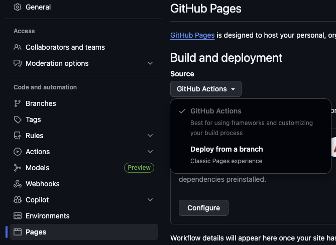

# slidesk

A GitHub actions to deploy your [Slidesk](https://slidesk.github.io/slidesk-doc/) presentation on GitHub pages.

The action will :

* Build your presentation with `slidesk`
* Publish it on GitHub pages

## Prerequisites

* GitHub Pages must be enabled on your project and setup on `GitHub Actions`



* Don't forget to add the permissions in your workflow file, as showed in [example](#very-important)

```yml
permissions:
  contents: read
  pages: write       # required by deploy-pages
  id-token: write    # required by deploy-pages
```

## Inputs

| Input | Description | Default value |
|-------|-------------|---------------|
| output-dir | Directory containing the static site output | public |
| workdir | Directory containing `main.sdf` slidesk file | . |

## Samples

### Default configuration

```yml
name: Deploy with Slidesk
on:
  push:
    branches: [ "main" ]

## Very important
permissions:
  contents: read
  pages: write       # required by deploy-pages
  id-token: write    # required by deploy-pages

jobs:
  slidesk:
    runs-on: ubuntu-latest
    steps:
      - uses: actions/checkout@v4

      - name: Build & Deploy
        uses: yodamad-actions/slidesk@1.0.0
```

### All options overriden

```yml
name: Deploy with Slidesk
on:
  push:
    branches: [ "main" ]

## Very important
permissions:
  contents: read
  pages: write       # required by deploy-pages
  id-token: write    # required by deploy-pages

jobs:
  slidesk:
    runs-on: ubuntu-latest
    steps:
      - uses: actions/checkout@v4

      - name: Build & Deploy
        uses: yodamad-actions/slidesk@1.0.0
        with:
          output-dir: public
          workdir: slidesk
```
